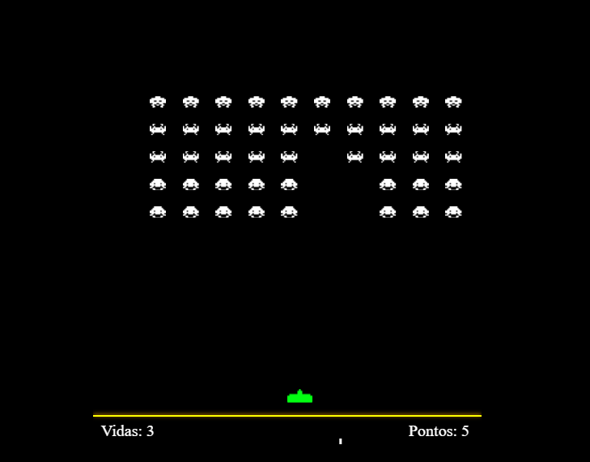

   # 👾 Invasores Espaciais

Projeto de um jogo inspirado no clássico **Space Invaders**, desenvolvido por **Aline Ferk**, utilizando **HTML5**, **CSS3** e **JavaScript (Canvas API)**.

---

## 🎮 Como Jogar

- **← / → (Setas Laterais):** Mover a nave  
- **Barra de Espaço:** Atirar  
- **Objetivo:** Eliminar todos os invasores antes que eles alcancem a parte inferior da tela.

---

## 🛠️ Tecnologias Utilizadas

- HTML5  
- CSS3  
- JavaScript (Canvas API)

---

## 📂 Estrutura do Projeto

---

## 📸 Imagem do Jogo

---

## 🚧 Status do Projeto

- ✅ Jogo funcionando localmente  
- ❌ Ainda sem versão online (GitHub Pages, Netlify ou outro)

**Como testar localmente:**

1. Clone ou baixe este repositório.  
2. Abra o arquivo `index.html` diretamente no navegador.

---

## ✅ Melhorias Futuras

- Sistema de pontuação  
- Controle de vidas  
- Aumento de dificuldade progressiva  
- Animações nos inimigos  
- Efeitos sonoros retrô  
- Tela de Game Over  
- Deploy online via GitHub Pages

---

## 📃 Licença

Projeto de código aberto.  
Uso livre para fins educacionais e não comerciais.

---
